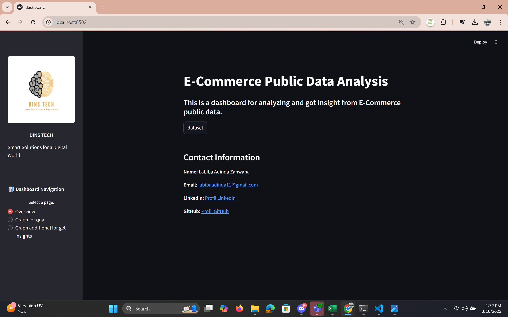
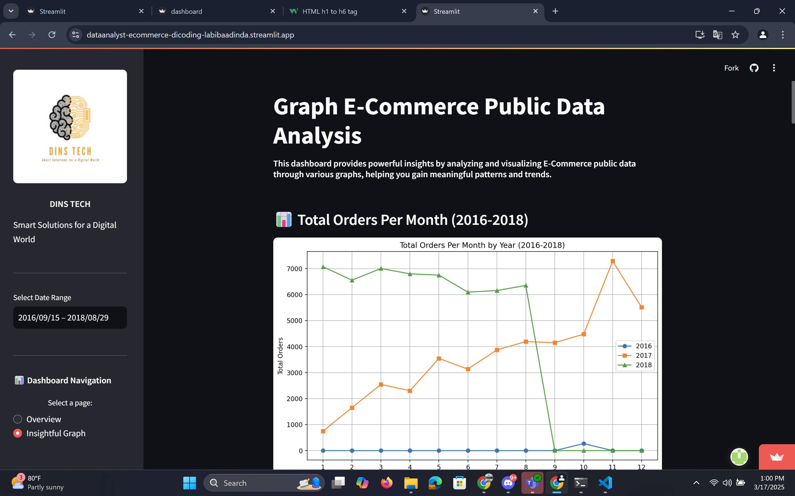
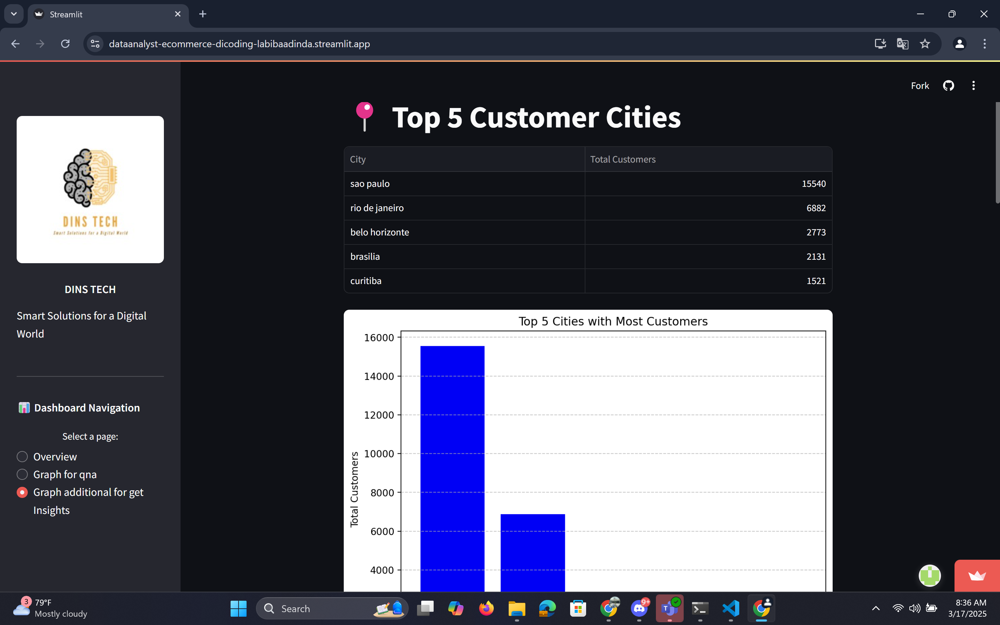

# E-Commerce Public Data Analysis with Python - Dicoding






[**E-Commerce Data Dashboard Streamlit App**](#)  

## 📖 Table of Contents
- [Overview](#overview)
- [Project Structure](#project-structure)
- [Installation](#installation)
- [Usage](#usage)
- [Data Sources](#data-sources)

---

## 📌 Overview
This project is a **data analysis and visualization** project focused on **E-Commerce Public Data**. It includes:
- ✅ **Data Wrangling**: Cleaning and preparing the dataset
- ✅ **Exploratory Data Analysis (EDA)**: Gaining insights from data
- ✅ **Streamlit Dashboard**: Interactive visualizations

The goal is to analyze customer behavior, purchase patterns, and key business metrics.

---

## 📂 Project Structure
```
📂 submission/      # Main project directory
├── 📂 dashboard/   # Streamlit Dashboard
│   ├── dashboard.py    # Streamlit app script
│   ├── main_data.csv   # Main dataset for dashboard
│   ├── cleaned_df_customer.csv    # Processed customer data
│   ├── cleaned_df_order.csv       # Processed order data
│   ├── cleaned_df_category.csv    # Product category data
│   ├── cleaned_df_seller.csv      # Seller information
│   ├── cleaned_df_product.csv     # Product details
│   ├── cleaned_geolocation_dataset.csv  # Geolocation dataset
│   ├── cleaned_order_2016.csv     # Order data from 2016
│   ├── cleaned_order_2017.csv     # Order data from 2017
│   ├── cleaned_order_2018.csv     # Order data from 2018
│   ├── cleaned_order_payments_dataset.csv  # Payment details
│   ├── logo.png        # Project logo
├── notebook.ipynb      # Jupyter notebook for data wrangling & EDA
├── README.md           # Project documentation (this file)
├── requirements.txt    # Python dependencies
└── url.txt             # Reference URLs or dataset links
```

---

## 🔧 Installation
To run this project, follow these steps:

### 1️⃣ Clone the Repository
```bash
git clone https://github.com/yourusername/data-analyst-dicoding.git
cd data-analyst-dicoding
```

### 2️⃣ Install Required Dependencies
Ensure you have Python installed, then install dependencies:
```bash
pip install -r requirements.txt
```

---

## 🚀 Usage
### 📊 **Run the Streamlit Dashboard**
To launch the interactive dashboard:
```bash
cd submission/dashboard
streamlit run dashboard.py
```
The dashboard will be available at **http://localhost:8501/**

### 📈 **Perform Data Wrangling & EDA**
Use Jupyter Notebook for data analysis:
```bash
jupyter notebook notebook.ipynb
```

---

## 📊 Data Sources
This project uses the **E-Commerce Public Dataset** from **[Dicoding’s Final Project](https://www.dicoding.com/)**.

---

## 📧 Contact
If you have any questions, feel free to reach out:
- **Name:** Labiba Adinda Zahwana
- **LinkedIn:** [Profile](https://id.linkedin.com/in/labibaadinda/)
- **GitHub:** [Profile](https://github.com/labibaadinda)

